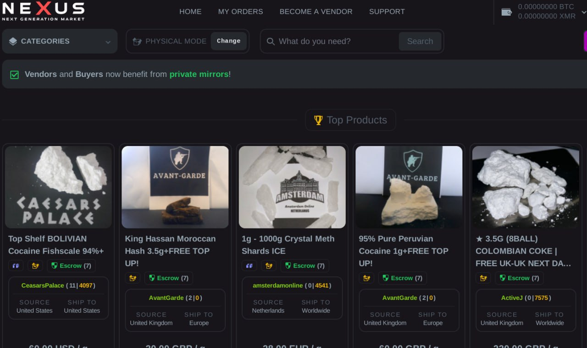

Welcome to **nexus darknet** — your ultimate solution for enhancing your online store's reputation 🌟 With a focus on **nexus onion mirror**, we deliver unparalleled worldwide shipping services, empowering businesses to expand their global reach and elevate customer trust. Transform your platform today and experience the difference with our trusted solutions!  

## Features of **nexus link**

🌟 Discover why **nexus link** is the ultimate platform for seamless global transactions and exceptional user experiences. Below are the standout features that make us a leader in the industry:

- 🌍 **International Logistics and Delivery System**: With our cutting-edge **nexus link** logistics network, you can effortlessly ship products worldwide. Our reliable system ensures timely deliveries while keeping you updated every step of the way. 

- 💫 **Advanced Digital Payments**: Experience next-generation payment solutions with support for both traditional methods and modern blockchain-based payments. This innovation allows users to enjoy faster, secure, and transparent transactions using **nexus darknet market url** technology.

- 🛡️ **Advanced Transaction Protection**: At **nexus link**, we prioritize your peace of mind. Our advanced protection mechanisms safeguard every transaction, ensuring that your financial activities remain safe from fraud and unauthorized access.

- 🗝️ **Financial Privacy Features**: Protect what matters most—your privacy. Our robust privacy tools empower users to maintain confidentiality during all transactions, giving you full control over your data and finances.

- 👥 **Professional Customer Service**: Need assistance? Our dedicated team is always ready to help. Whether it’s resolving issues or guiding you through new features, **nexus link** offers unmatched customer service tailored to your needs. 

Ready to experience the future of transactions? Explore more and get started today! 

## 🛡️ Trust and Reliability with **nexus darknet**

Welcome to the heart of what makes **nexus darknet** a secure, reliable, and privacy-focused platform for your financial needs. Whether you're handling traditional currencies or exploring modern payment options like **nexus official site**, we’ve got you covered. Let’s dive into why **nexus darknet** stands out in the world of digital transactions.

---

### Advanced Platform Protection Measures

At **nexus darknet**, security is our top priority. We employ cutting-edge encryption protocols and multi-layered defense mechanisms to ensure that your data remains safe from unauthorized access. Our advanced fraud detection algorithms work around the clock to monitor suspicious activities and protect your account.

Our commitment to security means peace of mind for you—no matter where you are or what device you’re using.

---

### Financial Privacy and Transaction Anonymity

We understand the importance of keeping your financial details private. With **nexus darknet**, you can enjoy complete transaction anonymity while maintaining full control over your funds. Your personal information is safeguarded with industry-leading standards, ensuring only you have access to your financial history.

🔒 Every transaction on **nexus darknet** prioritizes your right to privacy without compromising transparency when needed.

---

### Modern Payment Processing (Including Blockchain)

In today’s fast-paced world, staying ahead requires embracing innovation. That’s why **nexus darknet** supports modern payment processing methods, including blockchain technology. This allows for faster, more efficient transactions with lower fees compared to traditional systems.

🌟 By integrating blockchain, we offer seamless transfers that are both secure and transparent—perfect for users who value speed and reliability.

---

### Multi-Currency Support and Digital Assets (**nexus official site**)

Whether you prefer fiat currencies or want to explore the exciting realm of **nexus official site**, **nexus darknet** offers comprehensive multi-currency support. Convert between different assets effortlessly, store them safely, and manage all your finances in one place.

💰 Expand your portfolio with confidence knowing that **nexus darknet** provides robust tools to help you navigate the evolving landscape of digital assets.

---

### Decentralized Transaction Protection

Decentralization isn’t just a buzzword—it’s a core principle behind **nexus darknet**. By leveraging decentralized networks, we minimize single points of failure and enhance the resilience of our platform. This ensures that your transactions are protected against downtime and external threats.

🔗 Together, let’s build a future where trust is decentralized and empowerment is centralized!

---

### Proven Track Record: Uptime and Availability

Since its inception, **nexus darknet** has maintained an impressive uptime record, consistently delivering high availability even during peak usage periods. Our infrastructure is designed to handle large volumes of transactions without compromising performance.

✅ Rest assured that whether it’s day or night, **nexus darknet** will be there for you whenever you need it most.

---

Ready to experience the ultimate in security, privacy, and reliability? Join thousands of satisfied users who trust **nexus darknet** for their financial needs.

## 🌟 Benefits of Using **nexus darknet shop**

Discover why **nexus darknet shop** is the ultimate solution for your business needs:

- 🌍 **Access to a Global Marketplace**: With **nexus darknet shop**, you can tap into a vast global marketplace, connecting with customers and partners worldwide. This opens up new opportunities for growth and expansion, ensuring your business remains competitive in an ever-evolving market. 

- 🔐 **Secure Payment Methods**: Rest assured knowing that **nexus darknet shop** offers state-of-the-art secure payment methods. Our platform ensures all transactions are safeguarded, giving you peace of mind while handling sensitive financial data.

- 👨‍💻 **Professional Support Availability**: Need help? Our professional support team is available around the clock to assist you with any queries or issues. Whether it's technical support or guidance on using **nexus onion link**, we're here to ensure a seamless experience.

- ⚡ **Platform Reliability**: Built for performance and reliability, **nexus darknet shop** guarantees minimal downtime and maximum efficiency. This ensures your operations run smoothly without interruptions, boosting productivity and customer satisfaction. 

Ready to experience the power of **nexus darknet shop**? 

# Getting Started with **nexus market**

Welcome to **nexus market**! This guide will help you get started by setting up your account, configuring the payment system, and using the transaction system—all while ensuring top-notch security. Follow these simple steps:

---

1. 🛡️ **Set Up Account Protection**
   - Begin by creating a secure account on **nexus market**.
   - Enable two-factor authentication (2FA) to safeguard your account from unauthorized access.
   - Set strong, unique passwords following our recommended guidelines.
   - 

2. 💳 **Configure the Payment System**
   - Navigate to the **Settings** section of **nexus market**.
   - Add your preferred payment methods, such as credit/debit cards or bank accounts.
   - Verify your payment details for seamless transactions.
   - Ensure all financial information is encrypted using **nexus official link** technology.

3. 🔄 **Start Using the Transaction System**
   - Once your payment methods are verified, explore the intuitive interface of **nexus market**.
   - Initiate transactions by selecting the appropriate options under the **Transactions** tab.
   - Monitor your activity in real-time through detailed reports and alerts.
   - 

4. 🔍 **Review Security Settings**
   - Double-check that all security features are enabled, including automatic logout and session tracking.
   - Regularly update your personal information and payment details to maintain accuracy.
   - Leverage **nexus official link** tools to enhance privacy and protection.

5. 🎯 **Optimize Your Experience**
   - Customize notifications to stay informed about important updates or suspicious activities.
   - Explore additional features offered by **nexus market**, such as analytics and budgeting tools.
   - Reach out to our support team if you encounter any issues.

---

Ready to take control of your finances? Get started now with **nexus market**!

## 🌟 Support for **nexus shop url**

Need help? We’ve got you covered! Our team provides round-the-clock assistance to ensure your experience with **nexus shop url** is seamless and successful. Here's how we support you:

### 24/7 Professional Support  
Our dedicated experts are available **24/7**, ensuring you receive reliable and timely assistance whenever you need it. Whether it’s troubleshooting or optimizing **nexus onion mirror**, our professionals are here to help.  

### Multiple Support Channels  
Reach out to us through your preferred method:  
- Email 📧  
- Live Chat 💬  
- Phone Call ☎️  
- Community Forums 🗣️  

  

### Quick Response Times  
We pride ourselves on fast response times, addressing your queries promptly so you can focus on what matters most.  

### Expert Assistance  
Our team consists of seasoned experts specializing in **nexus shop url** and **nexus onion mirror**. They bring deep technical knowledge and hands-on experience to resolve even the most complex issues.  

---

For any questions or concerns, don’t hesitate to contact us!  

